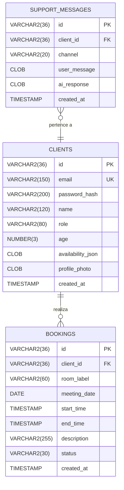
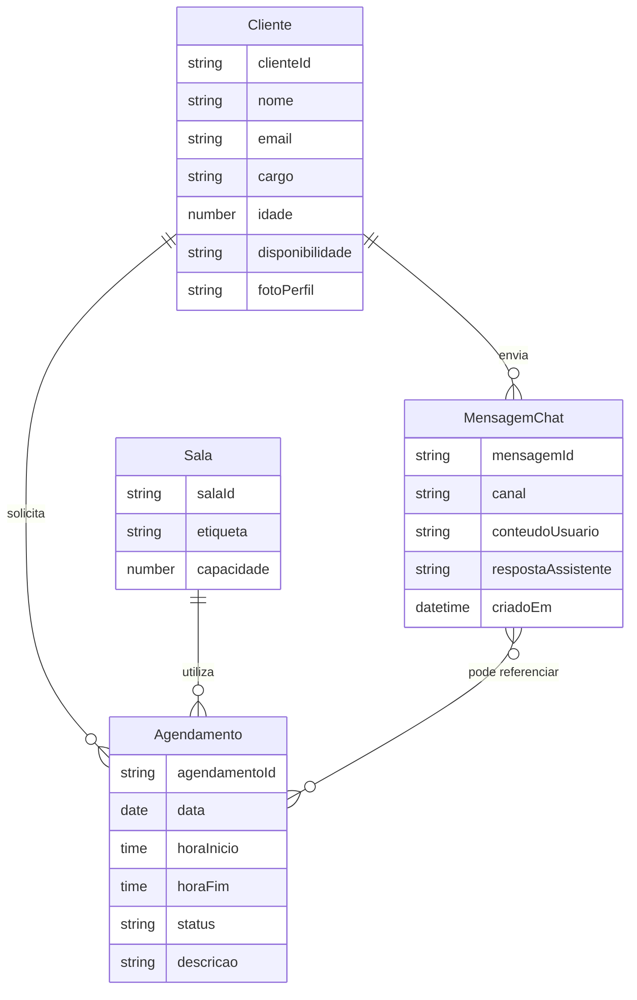

# Meeting Room Scheduler API

Backend completo (Express + TypeScript + Oracle) para reservar salas de reunião, conversar com suporte e com um assistente virtual, além de executar rotinas PL/SQL que liberam agendamentos expirados. Este README documenta tudo o que é necessário para desenvolvimento, integração e operação.

---

## Índice

- [Meeting Room Scheduler API](#meeting-room-scheduler-api)
  - [Índice](#índice)
  - [Visão Geral](#visão-geral)
  - [Arquitetura e Tecnologias](#arquitetura-e-tecnologias)
  - [Setup Local](#setup-local)
  - [Variáveis de Ambiente](#variáveis-de-ambiente)
  - [Scripts NPM](#scripts-npm)
  - [Estrutura de Pastas](#estrutura-de-pastas)
  - [Banco de Dados e PL/SQL](#banco-de-dados-e-plsql)
    - [Tabelas sugeridas](#tabelas-sugeridas)
    - [Procedure PL/SQL](#procedure-plsql)
  - [Diagramas DER e MER](#diagramas-der-e-mer)
    - [DER (físico)](#der-físico)
    - [MER (conceitual)](#mer-conceitual)
  - [Fluxos Principais](#fluxos-principais)
  - [Guia de Endpoints](#guia-de-endpoints)
  - [Disponibilidade e Perfil](#disponibilidade-e-perfil)
  - [Integração com Chat IA](#integração-com-chat-ia)
  - [Testes Rápidos](#testes-rápidos)
  - [Documentação para o App React Native](#documentação-para-o-app-react-native)

---

## Visão Geral

- API REST para gerenciamento de clientes, perfis e agendamentos de salas.
- Chat de suporte e chat IA (OpenAI ou fallback heurístico).
- Autenticação via JWT, senhas com bcrypt.
- Procedure PL/SQL `PROC_RELEASE_EXPIRED_BOOKINGS` exposta via endpoint.

## Arquitetura e Tecnologias

- **Node.js 18+**
- **Express 4**
- **TypeScript** (ESM, `tsx` em dev)
- **OracleDB Driver (`oracledb`)**
- **JWT (`jsonwebtoken`)** e **`bcryptjs`**
- **express-validator** para payloads
- **OpenAI SDK** (opcional)

## Setup Local

1. Instale dependências:
   ```bash
   npm install
   ```
2. Copie `.env.example` → `.env` e configure:
   - Credenciais Oracle (`ORACLE_USER`, etc.)
   - `JWT_SECRET`
   - Opcional: `OPENAI_API_KEY`, `OPENAI_MODEL`
3. Crie as tabelas/procedure (ver seção [Banco de Dados](#banco-de-dados-e-plsql)).
4. Execute:
   ```bash
   npm run dev        # hot reload
   # ou
   npm run build && npm start
   ```

## Variáveis de Ambiente

| Variável | Descrição |
|----------|-----------|
| `PORT` | Porta HTTP (default 4000). |
| `JWT_SECRET` | Segredo para tokens. |
| `ORACLE_USER` / `ORACLE_PASSWORD` | Credenciais Oracle. |
| `ORACLE_CONNECTION_STRING` | Ex.: `localhost/FREEPDB1`. |
| `ORACLE_POOL_MIN/MAX/INCREMENT` | Ajustes do pool. |
| `OPENAI_API_KEY` | Habilita Chat IA real (opcional). |
| `OPENAI_MODEL` | Modelo (default `gpt-3.5-turbo`). |

## Scripts NPM

- `npm run dev` – `tsx watch src/server.ts`
- `npm run build` – `tsc -p tsconfig.json`
- `npm start` – `node dist/server.js`

## Estrutura de Pastas

```
src/
  config/oracle.ts            # Pool do Oracle
  controllers/                # Regras de negócio
  middleware/                 # auth JWT + validação
  routes/                     # definição de endpoints
  services/aiService.ts       # integração OpenAI + fallback
  types/express/              # augment de Request.user
  utils/db.ts                 # helper withOracleConnection
docs/
  react-native-integration.md # guia para o app mobile
plsql/automation.sql          # procedure PROC_RELEASE_EXPIRED_BOOKINGS
```

## Banco de Dados e PL/SQL

### Tabelas sugeridas

```sql
CREATE TABLE clients (
  id              VARCHAR2(36) PRIMARY KEY,
  email           VARCHAR2(150) UNIQUE NOT NULL,
  password_hash   VARCHAR2(200) NOT NULL,
  name            VARCHAR2(120),
  role            VARCHAR2(80),
  age             NUMBER(3),
  availability_json CLOB,
  profile_photo   CLOB,
  created_at      TIMESTAMP DEFAULT SYSTIMESTAMP
);

CREATE TABLE bookings (
  id            VARCHAR2(36) PRIMARY KEY,
  client_id     VARCHAR2(36) REFERENCES clients(id),
  room_label    VARCHAR2(60) NOT NULL,
  meeting_date  DATE NOT NULL,
  start_time    TIMESTAMP NOT NULL,
  end_time      TIMESTAMP NOT NULL,
  description   VARCHAR2(255),
  status        VARCHAR2(30) DEFAULT 'ACTIVE',
  created_at    TIMESTAMP DEFAULT SYSTIMESTAMP
);

CREATE TABLE support_messages (
  id            VARCHAR2(36) PRIMARY KEY,
  client_id     VARCHAR2(36) REFERENCES clients(id),
  channel       VARCHAR2(20) CHECK (channel IN ('SUPPORT','AI')),
  user_message  CLOB NOT NULL,
  ai_response   CLOB,
  created_at    TIMESTAMP DEFAULT SYSTIMESTAMP
);
```

### Procedure PL/SQL

Arquivo `plsql/automation.sql`:
```sql
CREATE OR REPLACE PROCEDURE proc_release_expired_bookings (p_released OUT NUMBER) AS
BEGIN
  UPDATE bookings
     SET status = 'FINISHED'
   WHERE status = 'ACTIVE'
     AND end_time < SYSTIMESTAMP;

  p_released := SQL%ROWCOUNT;
  COMMIT;
END;
/
```

Execute via `sqlplus user/password@//host/service @plsql/automation.sql` e acione `POST /automation/release-expired`.

## Diagramas DER e MER

### DER (físico)



### MER (conceitual)



## Fluxos Principais

- **Cadastro/Login:** `POST /auth/register` armazena hash da senha; `POST /auth/login` retorna JWT válido por 8 horas.
- **Perfil:** `GET/PUT /profile/me` permitem ver/atualizar nome, cargo, idade, disponibilidade (JSON) e foto (base64/URL).
- **Agendamentos:** `POST /bookings` checa conflitos; `PATCH /bookings/:id` atualiza; `PATCH /bookings/:id/cancel` marca como cancelado. Todos os horários usam `meetingDate` + `startTime`/`endTime`.
- **Chat:** `POST /chat/support` salva mensagens do cliente; `POST /chat/ai` chama OpenAI (quando configurado) e salva a resposta.
- **Automação:** `POST /automation/release-expired` executa a procedure para finalização automática.

## Guia de Endpoints

| Método | Path | Descrição | Payload | Exemplo sucesso |
|--------|------|-----------|---------|-----------------|
| GET | `/health` | Status da API | — | `{ "status": "ok", "timestamp": "..." }` |
| POST | `/auth/register` | Cadastro | `{ email, password, name }` | `{ token, client }` |
| POST | `/auth/login` | Login | `{ email, password }` | `{ token, client }` |
| GET | `/profile/me` | Perfil autenticado | — | `{ id, email, name, role, age, availability, profilePhoto }` |
| PUT | `/profile/me` | Atualizar perfil | Campos parciais | Perfil atualizado |
| POST | `/bookings` | Criar agendamento | `room`, `meetingDate`, `startTime`, `endTime`, `description?` | Agendamento criado |
| GET | `/bookings` | Listar agendamentos | — | `[ { ... } ]` |
| PATCH | `/bookings/:bookingId` | Atualizar agendamento | campos parciais | Agendamento atualizado |
| PATCH | `/bookings/:bookingId/cancel` | Cancelar agendamento | — | `{ "message": "Agendamento cancelado." }` |
| POST | `/chat/support` | Enviar mensagem | `{ message }` | `{ id, channel: "SUPPORT", ... }` |
| GET | `/chat/support` | Histórico suporte | — | `[ ... ]` |
| POST | `/chat/ai` | Chat IA | `{ message }` | `{ id, message, aiResponse, createdAt }` |
| POST | `/automation/release-expired` | Executar procedure | — | `{ message, released }` |

> Todos exceto `/health` e `/auth/*` exigem `Authorization: Bearer <token>`.

## Disponibilidade e Perfil

Formato esperado:

```json
{
  "availability": {
    "monday": ["09:00-11:00", "13:00-17:00"],
    "tuesday": [],
    "wednesday": ["10:00-18:00"],
    "thursday": ["08:30-12:00"],
    "friday": ["09:00-15:00"],
    "saturday": [],
    "sunday": []
  }
}
```

Armazenado em `availability_json` para facilitar integrações futuras.

## Integração com Chat IA

- Configure `OPENAI_API_KEY` para usar o endpoint de chat com respostas reais (`generateAiResponse`).
- Sem a chave, o fallback heurístico em `services/aiService.ts` entra em ação.
- Mensagens são registradas em `support_messages` com canal `AI` e `ai_response`.

## Testes Rápidos

1. `POST /auth/register` → criar usuário.
2. `POST /auth/login` → guardar token.
3. `PUT /profile/me` → atualizar dados.
4. `POST /bookings` → criar reserva (teste conflito para ver HTTP 409).
5. `POST /chat/support` e `/chat/ai`.
6. Criar booking com data passada e acionar `POST /automation/release-expired`.

## Documentação para o App React Native

Consulte `docs/react-native-integration.md` para um passo-a-passo com Axios, interceptors, armazenamento de token e exemplos com React Query.
